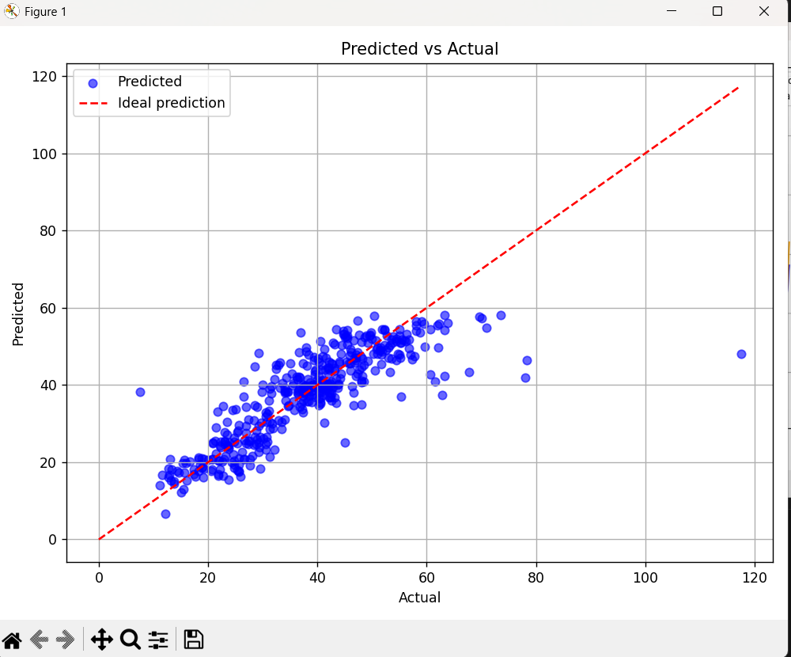

## 📂 Project Structure & Class Overview

| Class | Purpose / Description |
|-------|----------------------|
| **Dataset** | Encapsulates a dataset: feature matrix `X`, target vector `Y`, and the true weights used to generate `Y`. |
| **RegressionDataGenerator** | Generates random datasets for regression, with optional Gaussian noise. Includes methods for training and test data generation. |
| **LeastSquares** | Implements the least squares estimator: computes the optimal weights `w = (XᵀX)⁻¹ XᵀY` for linear regression. |
| **Matrix** | Provides utility methods for matrix operations: transpose, multiplication, and inversion (Gauss-Jordan method). |
| **PolynomialFeatures** | Expands features to polynomial terms up to a given degree for polynomial regression. |
| **CrossValidation** | Performs k-fold cross-validation to select the best polynomial degree and evaluate model performance. |
| **CVResult** | Data type that stores the results of cross-validation, including the best polynomial degree and corresponding MSE. |
| **Main** | Interactive program: asks user for dataset parameters, regression type, fits the model, predicts on new data, and computes metrics like MSE and R². |
| **RegressionPipeline** | A clean pipeline for solving regression problems using Cross-Validation with Polynomial Regression. |
| **HousePriceEstimator** | A class where the model is trained in order to predict house prices from a real world problem. Also Feature Engineering is applied. |
| **FindBestEstimator** | A class where the best k(number of folds) is found for the House Price Estimator. Basic Feature Engineering is applied. |

## Model Evaluation

## Overview
This section presents the evaluation of a regression model by comparing the predicted values with the actual ones for the House Price Problem. 
Both visual and quantitative methods are used to assess the model’s performance.

---

## Visual Evaluation

### Predicted vs Actual (per sample)
The following plot shows the predicted values and the true values across the test samples.

---

### Predicted vs Actual (scatter plot)
This scatter plot compares the predicted values against the actual values. The red dashed line represents the ideal case where predictions perfectly match the true values (*y = x*).

Most points lie close to the diagonal, indicating that the model captures the overall trend well. Larger deviations can be observed for extreme values.

---

## Quantitative Evaluation

| Metric | Value |
|------|------|
| RMSE | **56.23447** |
| R² Score | **0.69552** |

---

## Discussion
The model explains approximately 70% of the variance in the data, which indicates good overall performance. Predictions are more accurate for medium-range values, while errors increase for extreme cases. This suggests that the model has a slight bias toward the mean.

Overall, the model can be considered a solid baseline, with room for much more improvement.

---

## Future Improvements
- Use richer or more informative input features  
- Experiment with more expressive (non-linear or ensemble) models  
- Improve handling of outliers and extreme values  

---

## Features

- **From scratch** implementation with no external ML libraries  
- Supports **linear and polynomial regression**  
- Generates synthetic datasets for testing  
- Computes **Mean Squared Error (MSE)** and **R²** for model evaluation  
- **RegressionPipeline.java** can be called for any regression problem. You just need to load and feature-engineer the data set properly.

---
